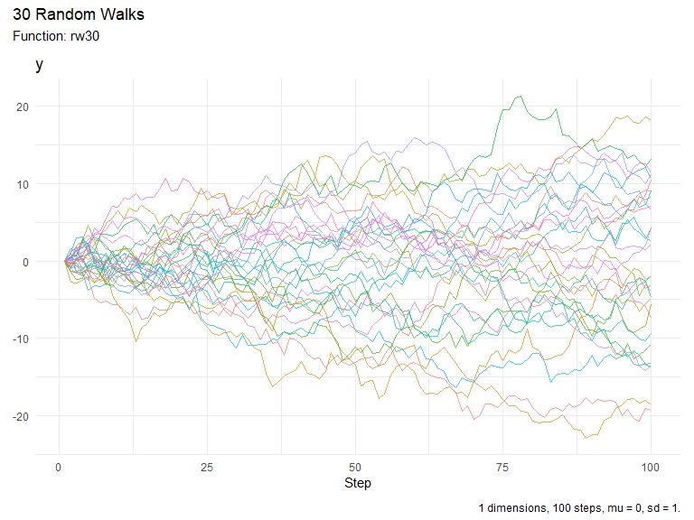

<!-- README.md is generated from README.Rmd. Please edit that file -->

# RandomWalker 

<!-- badges: start -->

[](https://cran.r-project.org/package=RandomWalker)


[](https://lifecycle.r-lib.org/articles/stages.html##experimental)
[](https://makeapullrequest.com)
<!-- badges: end -->

The goal of RandomWalker is to allow users to easily create Random Walks
of different types that are compatible with the `tidyverse` suite of
packages. The package is currently in the experimental stage of
development.

## Installation

You can install the released version of {TidyDensity} from CRAN with:

``` r
install.packages("RandomWalker")
```

You can install the development version of RandomWalker from
[GitHub](https://github.com/) with:

``` r
# install.packages("devtools")
devtools::install_github("spsanderson/RandomWalker")
```

## Example

This is a basic example which shows you how to solve a common problem:

``` r
library(RandomWalker)
## basic example code
rw30() |>
  head(10)
#> # A tibble: 10 × 3
#>    walk_number     x       y
#>    <fct>       <int>   <dbl>
#>  1 1               1  0     
#>  2 1               2  0.609 
#>  3 1               3  1.11  
#>  4 1               4  0.344 
#>  5 1               5 -0.627 
#>  6 1               6 -1.67  
#>  7 1               7 -0.713 
#>  8 1               8  0.0888
#>  9 1               9 -0.151 
#> 10 1              10 -0.534
```

Here is a basic visualization of a Random Walk:

``` r
rw30() |>
  visualize_walks()
```


