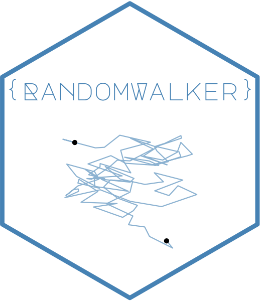
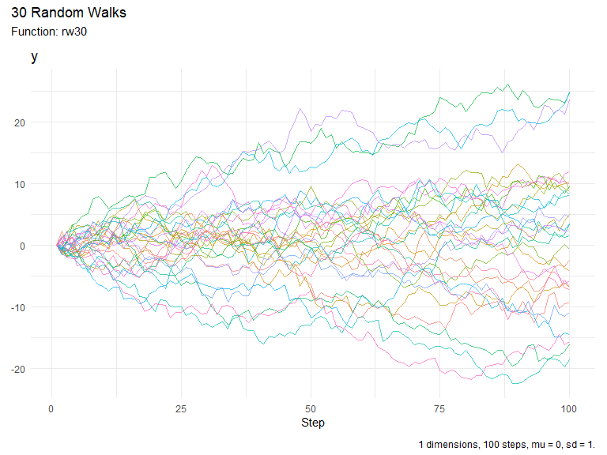
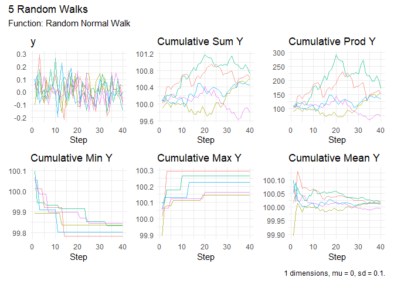
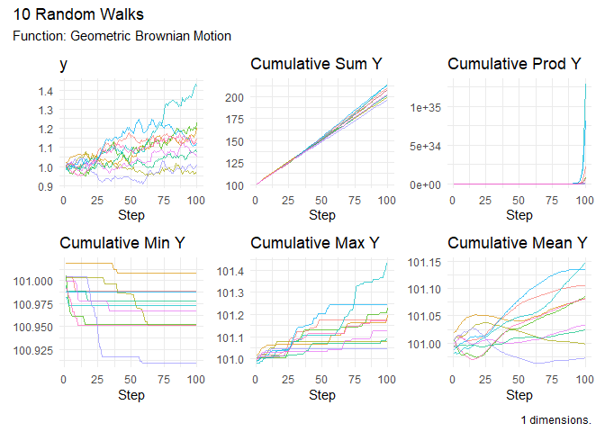
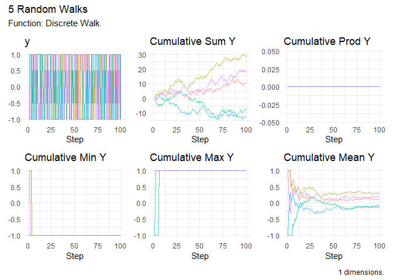

<!-- README.md is generated from README.Rmd. Please edit that file -->

# RandomWalker 

<!-- badges: start -->

[](https://cran.r-project.org/package=RandomWalker)


[](https://lifecycle.r-lib.org/articles/stages.html#stable)
[](https://makeapullrequest.com)
<!-- badges: end -->

> **Generate random walks of various types with tidyverse
> compatibility**

To view the full wiki, click here: [Full RandomWalker
Wiki](https://github.com/spsanderson/RandomWalker/blob/main/wiki/Home.md)

RandomWalker is a comprehensive R package that makes it easy to
generate, visualize, and analyze random walks. Whether you’re modeling
stock prices, simulating particle movements, or exploring stochastic
processes, RandomWalker provides a unified, tidyverse-compatible
interface with extensive distribution support.

## ✨ Key Features

- **🎲 27+ Distribution Types**: Generate random walks from Normal,
  Brownian Motion, Geometric Brownian Motion, Cauchy, Beta, Gamma,
  Poisson, and many more distributions
- **📐 Multi-Dimensional Support**: Create walks in 1D, 2D, or 3D space
- **📊 Rich Visualizations**: Built-in plotting functions with support
  for both static and interactive visualizations
- **📈 Statistical Analysis**: Comprehensive summary statistics
  including cumulative functions, confidence intervals, and distance
  metrics
- **🔧 Tidyverse Compatible**: Works seamlessly with dplyr, tidyr, and
  ggplot2
- **⚡ Easy to Use**: Sensible defaults with extensive customization
  options

## 📦 Installation

Install the stable version from CRAN:

``` r
install.packages("RandomWalker")
```

Or get the development version from GitHub for the latest features and
bug fixes:

``` r
# install.packages("devtools")
devtools::install_github("spsanderson/RandomWalker")
```

## 🚀 Quick Start

### Generate 30 Random Walks

The `rw30()` function provides a quick way to generate 30 random walks
with 100 steps each:

``` r
library(RandomWalker)

# Generate random walks
walks <- rw30()
head(walks, 10)
#> # A tibble: 10 × 3
#>    walk_number step_number        y
#>    <fct>             <int>    <dbl>
#>  1 1                     1  0      
#>  2 1                     2  0.00201
#>  3 1                     3  0.678  
#>  4 1                     4 -0.212  
#>  5 1                     5  1.21   
#>  6 1                     6  1.25   
#>  7 1                     7  1.95   
#>  8 1                     8  2.08   
#>  9 1                     9  2.33   
#> 10 1                    10  2.56
```

### Visualize Random Walks

Create beautiful visualizations with a single function call:

``` r
rw30() |>
  visualize_walks()
```



### Summarize Statistics

Get comprehensive statistical summaries of your random walks:

``` r
# Overall summary
rw30() |>
  summarize_walks(.value = y)
#> # A tibble: 1 × 16
#>   fns   fns_name dimensions mean_val median range quantile_lo quantile_hi
#>   <chr> <chr>         <dbl>    <dbl>  <dbl> <dbl>       <dbl>       <dbl>
#> 1 rw30  Rw30              1  -0.0607 -0.615  37.6       -13.4        14.2
#> # ℹ 8 more variables: variance <dbl>, sd <dbl>, min_val <dbl>, max_val <dbl>,
#> #   harmonic_mean <dbl>, geometric_mean <dbl>, skewness <dbl>, kurtosis <dbl>

# Summary by walk
rw30() |>
  summarize_walks(.value = y, .group_var = walk_number) |>
  head(10)
#> # A tibble: 10 × 17
#>    walk_number fns   fns_name dimensions mean_val  median range quantile_lo
#>    <fct>       <chr> <chr>         <dbl>    <dbl>   <dbl> <dbl>       <dbl>
#>  1 1           rw30  Rw30              1   -3.34  -3.51    8.94      -6.79 
#>  2 2           rw30  Rw30              1   -7.19  -8.24   14.0      -12.6  
#>  3 3           rw30  Rw30              1    4.29   3.69   13.0       -0.651
#>  4 4           rw30  Rw30              1   -4.67  -4.95    9.26      -7.85 
#>  5 5           rw30  Rw30              1    9.02   9.06   19.0        0.551
#>  6 6           rw30  Rw30              1    3.55   3.70   10.1       -1.27 
#>  7 7           rw30  Rw30              1    9.65   9.68   21.7       -0.282
#>  8 8           rw30  Rw30              1    0.244 -0.0674 12.7       -5.45 
#>  9 9           rw30  Rw30              1   -1.26  -1.48   10.5       -6.13 
#> 10 10          rw30  Rw30              1   -1.65  -1.75   11.5       -5.74 
#> # ℹ 9 more variables: quantile_hi <dbl>, variance <dbl>, sd <dbl>,
#> #   min_val <dbl>, max_val <dbl>, harmonic_mean <dbl>, geometric_mean <dbl>,
#> #   skewness <dbl>, kurtosis <dbl>
```

### Double pendulum trajectories

Simulate continuous-time pendulum motion from randomized starting
angles. The solver (`deSolve`) and animation packages (`gganimate`,
`gifski`) are optional.

``` r
set.seed(287)
pendulum <- double_pendulum_walk(.num_walks = 2, .n = 101)
plot_double_pendulum(pendulum, .walk = 1)
animation <- animate_double_pendulum(pendulum, .walk = 1)
# Render explicitly with gganimate::animate(); construction saves no files.
```

See `vignette("double-pendulum", package = "RandomWalker")` for units,
deterministic starts, and GIF rendering.

## 🎯 Common Use Cases

### 1. Custom Random Walks with Specific Distributions

``` r
# Normal walk with custom parameters
random_normal_walk(
  .num_walks = 5,
  .n = 50,
  .mu = 0,
  .sd = 0.1,
  .initial_value = 100
) |>
  visualize_walks()
```



``` r

# Geometric Brownian Motion (great for stock prices!)
geometric_brownian_motion(
  .num_walks = 10,
  .n = 100,
  .mu = 0.05,
  .sigma = 0.2,
  .initial_value = 100
) |>
  visualize_walks()
```



### 2. Multi-Dimensional Random Walks

``` r
# 2D random walk
random_normal_walk(.num_walks = 3, .n = 100, .dimensions = 2) |>
  head(10)
#> # A tibble: 10 × 14
#>    walk_number step_number        x       y cum_sum_x cum_prod_x cum_min_x
#>    <fct>             <int>    <dbl>   <dbl>     <dbl>      <dbl>     <dbl>
#>  1 1                     1  0.0281   0.0322  0.0281            0    0.0281
#>  2 1                     2 -0.0404  -0.0737 -0.0124            0   -0.0404
#>  3 1                     3  0.0548   0.139   0.0424            0   -0.0404
#>  4 1                     4 -0.129   -0.103  -0.0866            0   -0.129 
#>  5 1                     5  0.0448  -0.0530 -0.0419            0   -0.129 
#>  6 1                     6  0.0281  -0.103  -0.0138            0   -0.129 
#>  7 1                     7 -0.00585 -0.0614 -0.0196            0   -0.129 
#>  8 1                     8  0.0187   0.0235 -0.000947          0   -0.129 
#>  9 1                     9  0.0242  -0.0573  0.0233            0   -0.129 
#> 10 1                    10  0.0638   0.0297  0.0871            0   -0.129 
#> # ℹ 7 more variables: cum_max_x <dbl>, cum_mean_x <dbl>, cum_sum_y <dbl>,
#> #   cum_prod_y <dbl>, cum_min_y <dbl>, cum_max_y <dbl>, cum_mean_y <dbl>

# 3D random walk
random_normal_walk(.num_walks = 2, .n = 50, .dimensions = 3) |>
  head(10)
#> # A tibble: 10 × 20
#>    walk_number step_number        x        y         z cum_sum_x cum_prod_x
#>    <fct>             <int>    <dbl>    <dbl>     <dbl>     <dbl>      <dbl>
#>  1 1                     1  0.132    0.00328 -0.000246   0.132            0
#>  2 1                     2 -0.0380   0.0549   0.0565     0.0943           0
#>  3 1                     3 -0.00682  0.0286  -0.0404     0.0874           0
#>  4 1                     4 -0.154   -0.171    0.139     -0.0667           0
#>  5 1                     5  0.0191  -0.171   -0.0285    -0.0477           0
#>  6 1                     6 -0.0126  -0.00421  0.107     -0.0603           0
#>  7 1                     7  0.0694   0.0641  -0.201      0.00912          0
#>  8 1                     8  0.0890  -0.00921  0.00900    0.0981           0
#>  9 1                     9 -0.0525  -0.219   -0.0246     0.0456           0
#> 10 1                    10 -0.0380   0.0927   0.0425     0.00760          0
#> # ℹ 13 more variables: cum_min_x <dbl>, cum_max_x <dbl>, cum_mean_x <dbl>,
#> #   cum_sum_y <dbl>, cum_prod_y <dbl>, cum_min_y <dbl>, cum_max_y <dbl>,
#> #   cum_mean_y <dbl>, cum_sum_z <dbl>, cum_prod_z <dbl>, cum_min_z <dbl>,
#> #   cum_max_z <dbl>, cum_mean_z <dbl>
```

### 3. Discrete Random Walks

``` r
# Discrete walk with upper/lower bounds
discrete_walk(
  .num_walks = 5,
  .n = 100,
  .upper_bound = 1,
  .lower_bound = -1,
  .upper_probability = 0.55,
  .initial_value = 0
) |>
  visualize_walks()
```



## 📚 Available Random Walk Types

RandomWalker supports a wide variety of random walk types:

### Continuous Distributions

- **Normal**: `random_normal_walk()`, `random_normal_drift_walk()`
- **Brownian Motion**: `brownian_motion()`,
  `geometric_brownian_motion()`
- **Beta**: `random_beta_walk()`
- **Cauchy**: `random_cauchy_walk()`
- **Chi-Squared**: `random_chisquared_walk()`
- **Exponential**: `random_exponential_walk()`
- **F-Distribution**: `random_f_walk()`
- **Gamma**: `random_gamma_walk()`
- **Log-Normal**: `random_lognormal_walk()`
- **Logistic**: `random_logistic_walk()`
- **Student’s t**: `random_t_walk()`
- **Uniform**: `random_uniform_walk()`
- **Weibull**: `random_weibull_walk()`
- **And more!**

### Discrete Distributions

- **Binomial**: `random_binomial_walk()`
- **Discrete**: `discrete_walk()`
- **Geometric**: `random_geometric_walk()`
- **Hypergeometric**: `random_hypergeometric_walk()`
- **Multinomial**: `random_multinomial_walk()`
- **Negative Binomial**: `random_negbinomial_walk()`
- **Poisson**: `random_poisson_walk()`

### Custom Walks

- **Custom Displacement**: `custom_walk()`, `random_displacement_walk()`

## 🛠️ Key Functions

| Function                | Description                                    |
|-------------------------|------------------------------------------------|
| `rw30()`                | Quickly generate 30 random walks               |
| `visualize_walks()`     | Create visualizations (static or interactive)  |
| `summarize_walks()`     | Generate comprehensive statistics              |
| `subset_walks()`        | Subset walks by max/min values                 |
| `euclidean_distance()`  | Calculate distances in multi-dimensional walks |
| `confidence_interval()` | Compute confidence intervals                   |
| `running_quantile()`    | Calculate running quantiles                    |

## 📖 Documentation

- **Getting Started Guide**: See `vignette("getting-started")`
- **Function Reference**: [Online
  Documentation](https://www.spsanderson.com/RandomWalker/)
- **Package Website**:
  [RandomWalker](https://www.spsanderson.com/RandomWalker/)
- **News and Updates**: Check [NEWS.md](NEWS.md) for latest changes

## 🤝 Contributing

Contributions are welcome! Please feel free to submit a Pull Request.
For major changes, please open an issue first to discuss what you would
like to change.

## 📄 License

This package is licensed under the MIT License. See
[LICENSE.md](LICENSE.md) for details.

## 👥 Authors

- **Steven P. Sanderson II, MPH** - *Author, Creator, Maintainer* -
  [GitHub](https://github.com/spsanderson)
- **Antti Rask** - *Contributor* - Visualization functions

## 📞 Getting Help

- **Bug Reports**: [GitHub
  Issues](https://github.com/spsanderson/RandomWalker/issues)
- **Questions**: Use GitHub Discussions or Stack Overflow with the
  `randomwalker` tag
- **Website**: <https://www.spsanderson.com/RandomWalker/>

## 🌟 Citation

If you use RandomWalker in your research, please cite:

``` r
citation("RandomWalker")
```

------------------------------------------------------------------------

**Made with ❤️ for the R community**
