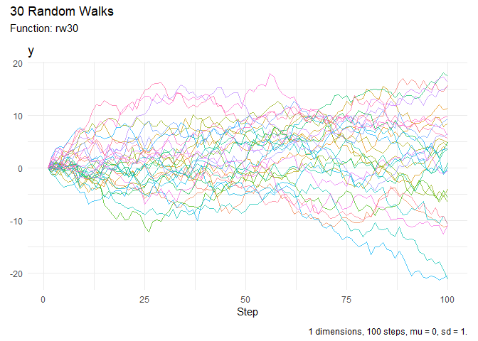

<!-- README.md is generated from README.Rmd. Please edit that file -->

# RandomWalker 

<!-- badges: start -->
[](https://cran.r-project.org/package=RandomWalker)


[](https://lifecycle.r-lib.org/articles/stages.html#stable)
[](https://makeapullrequest.com)
<!-- badges: end -->

> **Generate random walks of various types with tidyverse compatibility**

RandomWalker is a comprehensive R package that makes it easy to generate, visualize, and analyze random walks. Whether you're modeling stock prices, simulating particle movements, or exploring stochastic processes, RandomWalker provides a unified, tidyverse-compatible interface with extensive distribution support.

## ✨ Key Features

- **🎲 27+ Distribution Types**: Generate random walks from Normal, Brownian Motion, Geometric Brownian Motion, Cauchy, Beta, Gamma, Poisson, and many more distributions
- **📐 Multi-Dimensional Support**: Create walks in 1D, 2D, or 3D space
- **📊 Rich Visualizations**: Built-in plotting functions with support for both static and interactive visualizations
- **📈 Statistical Analysis**: Comprehensive summary statistics including cumulative functions, confidence intervals, and distance metrics
- **🔧 Tidyverse Compatible**: Works seamlessly with dplyr, tidyr, and ggplot2
- **⚡ Easy to Use**: Sensible defaults with extensive customization options

## 📦 Installation

Install the stable version from CRAN:

```r
install.packages("RandomWalker")
```

Or get the development version from GitHub for the latest features and bug fixes:

```r
# install.packages("devtools")
devtools::install_github("spsanderson/RandomWalker")
```

## 🚀 Quick Start

### Generate 30 Random Walks

The `rw30()` function provides a quick way to generate 30 random walks with 100 steps each:

```r
library(RandomWalker)

# Generate random walks
walks <- rw30()
head(walks, 10)
#> # A tibble: 10 × 3
#>    walk_number step_number      y
#>    <fct>             <int>  <dbl>
#>  1 1                     1  0    
#>  2 1                     2  1.06 
#>  3 1                     3  0.977
#>  4 1                     4  1.86 
#>  5 1                     5  0.859
#>  6 1                     6  1.15 
#>  7 1                     7  0.708
#>  8 1                     8  1.02 
#>  9 1                     9 -1.18 
#> 10 1                    10 -0.772
```

### Visualize Random Walks

Create beautiful visualizations with a single function call:

```r
rw30() |>
  visualize_walks()
```



### Summarize Statistics

Get comprehensive statistical summaries of your random walks:

```r
# Overall summary
rw30() |>
  summarize_walks(.value = y)
#> # A tibble: 1 × 16
#>   fns   fns_name dimensions mean_val median range quantile_lo quantile_hi
#>   <chr> <chr>         <dbl>    <dbl>  <dbl> <dbl>       <dbl>       <dbl>
#> 1 rw30  Rw30              1    0.715  0.783  43.6       -10.8        13.3
#> # ℹ 8 more variables: variance <dbl>, sd <dbl>, min_val <dbl>, max_val <dbl>,
#> #   harmonic_mean <dbl>, geometric_mean <dbl>, skewness <dbl>, kurtosis <dbl>

# Summary by walk
rw30() |>
  summarize_walks(.value = y, .group_var = walk_number) |>
  head(10)
#> # A tibble: 10 × 17
#>    walk_number fns   fns_name dimensions mean_val median range quantile_lo
#>    <fct>       <chr> <chr>         <dbl>    <dbl>  <dbl> <dbl>       <dbl>
#>  1 1           rw30  Rw30              1     9.18   7.69 21.0       -0.513
#>  2 2           rw30  Rw30              1   -11.2  -11.5  21.3      -19.4  
#>  3 3           rw30  Rw30              1    -3.04  -1.97 13.9       -9.88 
#>  4 4           rw30  Rw30              1     2.28   1.39 14.5       -3.82 
#>  5 5           rw30  Rw30              1    10.9    8.44 20.8        1.88 
#>  6 6           rw30  Rw30              1    -6.00  -5.96 15.2      -14.5  
#>  7 7           rw30  Rw30              1     4.36   4.55  9.30      -0.333
#>  8 8           rw30  Rw30              1    -5.87  -5.96 11.2       -9.81 
#>  9 9           rw30  Rw30              1    -6.68  -6.53 15.5      -14.6  
#> 10 10          rw30  Rw30              1    -6.93  -4.43 22.6      -20.4  
#> # ℹ 9 more variables: quantile_hi <dbl>, variance <dbl>, sd <dbl>,
#> #   min_val <dbl>, max_val <dbl>, harmonic_mean <dbl>, geometric_mean <dbl>,
#> #   skewness <dbl>, kurtosis <dbl>
```

## 🎯 Common Use Cases

### 1. Custom Random Walks with Specific Distributions

```r
# Normal walk with custom parameters
random_normal_walk(
  .num_walks = 5,
  .n = 50,
  .mu = 0,
  .sd = 0.1,
  .initial_value = 100
) |>
  visualize_walks()

# Geometric Brownian Motion (great for stock prices!)
geometric_brownian_motion(
  .num_walks = 10,
  .n = 100,
  .mu = 0.05,
  .sigma = 0.2,
  .initial_value = 100
) |>
  visualize_walks()
```

### 2. Multi-Dimensional Random Walks

```r
# 2D random walk
random_normal_walk(.num_walks = 3, .n = 100, .dimensions = 2) |>
  head(10)
#> # A tibble: 10 × 8
#>    walk_number step_number      x      y cum_sum_x cum_sum_y cum_prod_x cum_prod_y
#>    <fct>             <int>  <dbl>  <dbl>     <dbl>     <dbl>      <dbl>      <dbl>
#>  1 1                     1  0      0          0         0          0          0    
#>  2 1                     2  0.106  0.197      0.106     0.197      0.106      0.197
#>  3 1                     3 -0.148 -0.024     -0.042     0.173     -0.0157    -0.005

# 3D random walk
random_normal_walk(.num_walks = 2, .n = 50, .dimensions = 3) |>
  head(10)
#> # A tibble: 10 × 11
#>    walk_number step_number      x      y      z cum_sum_x cum_sum_y cum_sum_z
#>    <fct>             <int>  <dbl>  <dbl>  <dbl>     <dbl>     <dbl>     <dbl>
#>  1 1                     1  0      0      0          0         0         0    
#>  2 1                     2  0.106  0.197 -0.031      0.106     0.197    -0.031
```

### 3. Discrete Random Walks

```r
# Discrete walk with upper/lower bounds
discrete_walk(
  .num_walks = 5,
  .n = 100,
  .upper_bound = 1,
  .lower_bound = -1,
  .upper_probability = 0.55,
  .initial_value = 0
) |>
  visualize_walks()
```

## 📚 Available Random Walk Types

RandomWalker supports a wide variety of random walk types:

### Continuous Distributions
- **Normal**: `random_normal_walk()`, `random_normal_drift_walk()`
- **Brownian Motion**: `brownian_motion()`, `geometric_brownian_motion()`
- **Beta**: `random_beta_walk()`
- **Cauchy**: `random_cauchy_walk()`
- **Chi-Squared**: `random_chisquared_walk()`
- **Exponential**: `random_exponential_walk()`
- **F-Distribution**: `random_f_walk()`
- **Gamma**: `random_gamma_walk()`
- **Log-Normal**: `random_lognormal_walk()`
- **Logistic**: `random_logistic_walk()`
- **Student's t**: `random_t_walk()`
- **Uniform**: `random_uniform_walk()`
- **Weibull**: `random_weibull_walk()`
- **And more!**

### Discrete Distributions
- **Binomial**: `random_binomial_walk()`
- **Discrete**: `discrete_walk()`
- **Geometric**: `random_geometric_walk()`
- **Hypergeometric**: `random_hypergeometric_walk()`
- **Multinomial**: `random_multinomial_walk()`
- **Negative Binomial**: `random_negbinomial_walk()`
- **Poisson**: `random_poisson_walk()`

### Custom Walks
- **Custom Displacement**: `custom_walk()`, `random_displacement_walk()`

## 🛠️ Key Functions

| Function | Description |
|----------|-------------|
| `rw30()` | Quickly generate 30 random walks |
| `visualize_walks()` | Create visualizations (static or interactive) |
| `summarize_walks()` | Generate comprehensive statistics |
| `subset_walks()` | Subset walks by max/min values |
| `euclidean_distance()` | Calculate distances in multi-dimensional walks |
| `confidence_interval()` | Compute confidence intervals |
| `running_quantile()` | Calculate running quantiles |

## 📖 Documentation

- **Getting Started Guide**: See `vignette("getting-started")`
- **Function Reference**: [Online Documentation](https://www.spsanderson.com/RandomWalker/)
- **Package Website**: [RandomWalker](https://www.spsanderson.com/RandomWalker/)
- **News and Updates**: Check [NEWS.md](NEWS.md) for latest changes

## 🤝 Contributing

Contributions are welcome! Please feel free to submit a Pull Request. For major changes, please open an issue first to discuss what you would like to change.

## 📄 License

This package is licensed under the MIT License. See [LICENSE.md](LICENSE.md) for details.

## 👥 Authors

- **Steven P. Sanderson II, MPH** - *Author, Creator, Maintainer* - [GitHub](https://github.com/spsanderson)
- **Antti Rask** - *Contributor* - Visualization functions

## 📞 Getting Help

- **Bug Reports**: [GitHub Issues](https://github.com/spsanderson/RandomWalker/issues)
- **Questions**: Use GitHub Discussions or Stack Overflow with the `randomwalker` tag
- **Website**: [https://www.spsanderson.com/RandomWalker/](https://www.spsanderson.com/RandomWalker/)

## 🌟 Citation

If you use RandomWalker in your research, please cite:

```r
citation("RandomWalker")
```

---

**Made with ❤️ for the R community**
