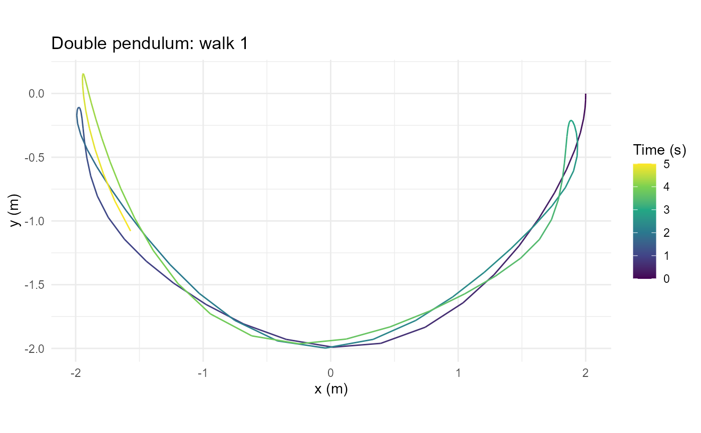
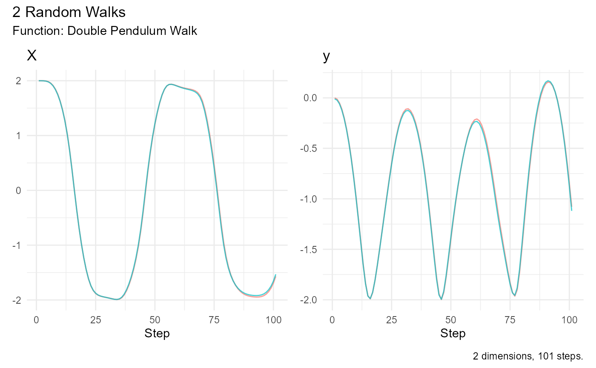

# Double Pendulum Trajectories

## Model and units

[`double_pendulum_walk()`](https://www.spsanderson.com/RandomWalker/reference/double_pendulum_walk.md)
models two point masses joined by rigid, massless rods in a vertical
plane. There is no friction or external forcing. Independent normal
perturbations of the initial angles create an ensemble of trajectories;
after initialization, motion is deterministic. This is not a
random-waiting-time walk. Large-angle motion can be chaotic, so small
starting differences can grow.

Angles are in radians from downward vertical, angular velocities in
radians per second, lengths in meters, masses in kilograms, and time in
seconds. Both angles are absolute. The pivot is `(0, 0)` and positive y
points upward.

The optional `deSolve` package is required for simulation. Install it
yourself before running these examples if it is unavailable. Plotting
uses `ggplot2`; animation additionally uses `gganimate`, and GIF
rendering uses `gifski`.

## Repeatable trajectories

``` r

set.seed(287)
walks <- double_pendulum_walk(.num_walks = 2, .n = 101)
head(walks)
#> # A tibble: 6 × 11
#>   walk_number step_number  time theta1 theta2 omega1     omega2    x1       y1
#>   <fct>             <int> <dbl>  <dbl>  <dbl>  <dbl>      <dbl> <dbl>    <dbl>
#> 1 1                     1  0      1.59   1.56  0      0         1.000  0.0145 
#> 2 1                     2  0.05   1.57   1.56 -0.490 -0.0000959 1.000  0.00223
#> 3 1                     3  0.1    1.54   1.56 -0.981 -0.000333  0.999 -0.0345 
#> 4 1                     4  0.15   1.48   1.56 -1.46  -0.0114    0.995 -0.0956 
#> 5 1                     5  0.2    1.39   1.55 -1.92  -0.0628    0.984 -0.180  
#> 6 1                     6  0.25   1.28   1.55 -2.33  -0.203     0.959 -0.283  
#> # ℹ 2 more variables: x <dbl>, y <dbl>
attr(walks, "initial_states")
#>        theta1   theta2 omega1 omega2
#> [1,] 1.585287 1.555304      0      0
#> [2,] 1.564327 1.566868      0      0
```

`.n` counts observations, including time zero. With `.n = 101` and the
default `.delta_time = 0.05`, the final observation is at five seconds.
The default 401 observations cover 20 seconds. Sampling intervals do not
constrain the adaptive solver’s internal integration steps.

`x1`, `y1` locate the first bob; `x`, `y` locate the second. These are
positions, not increments, so the generator does not add cumulative
statistics.

``` r

fixed <- double_pendulum_walk(.num_walks = 2, .n = 21, .angle_sd = 0)
```

Zero angle noise produces identical trajectories for identical initial
states and does not consume random numbers. Set `.theta1`, `.theta2`,
`.omega1`, and `.omega2` to choose other starts; masses, lengths, and
gravity are configurable.

## Plot and summarize

``` r

plot_double_pendulum(walks, .walk = 1)
```



The spatial plot shows the second bob’s path, with equal axis scaling
and color for elapsed time. `.walk` selects a walk label, not its
position in the data.

``` r

summarize_walks(walks, .value = x)
#> # A tibble: 1 × 17
#>   fns    fns_name dimensions   obs mean_val median range quantile_lo quantile_hi
#>   <chr>  <chr>         <int> <dbl>    <dbl>  <dbl> <dbl>       <dbl>       <dbl>
#> 1 doubl… Double …          2   101   -0.176 -0.648  3.99       -1.98        2.00
#> # ℹ 8 more variables: variance <dbl>, sd <dbl>, min_val <dbl>, max_val <dbl>,
#> #   harmonic_mean <dbl>, geometric_mean <dbl>, skewness <dbl>, kurtosis <dbl>
visualize_walks(walks, .pluck = c("x", "y"))
```



[`visualize_walks()`](https://www.spsanderson.com/RandomWalker/reference/visualize_walks.md)
shows coordinate traces against step number. Signed coordinates can
produce undefined geometric means in the existing summary function;
those statistics are not changed by this generator.

## Animate and save a GIF

Construction returns a customizable `gganim` object and does not render
or save files. Each sampled observation becomes a frame with both rods,
bobs, a pivot, elapsed time, and the second bob’s recent trail. Set
`.trail_length = 0` to hide the trail; otherwise it counts positions
including the current observation.

The following rendering example is intentionally not run during vignette
builds:

``` r

animation <- animate_double_pendulum(walks, .walk = 1, .trail_length = 30)
gif <- gganimate::animate(
  animation,
  nframes = attr(walks, "n"),
  fps = 1 / attr(walks, "delta_time"),
  width = 500, height = 500,
  renderer = gganimate::gifski_renderer()
)
gganimate::anim_save("double-pendulum.gif", animation = gif)
```

Use every sampled observation and the reciprocal sampling interval as
the frame rate to preserve simulated timing. Changing the frame rate
changes playback speed. The display uses discrete states with fixed
spatial limits and no tweening.

## Numerical model

The implementation uses LSODA with relative and absolute tolerances of
`1e-9`. The equations follow the [double-pendulum
derivation](https://www.myphysicslab.com/pendulum/double-pendulum-en.html)
with angle difference `theta1 - theta2`. This corrects the reversed
difference in the [original reference
script](https://github.com/spsanderson/random_r_projects/blob/main/double_pendulum/double_pendulum.r).
Long chaotic trajectories should not be interpreted as exact forecasts.
