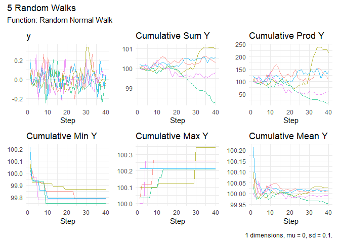
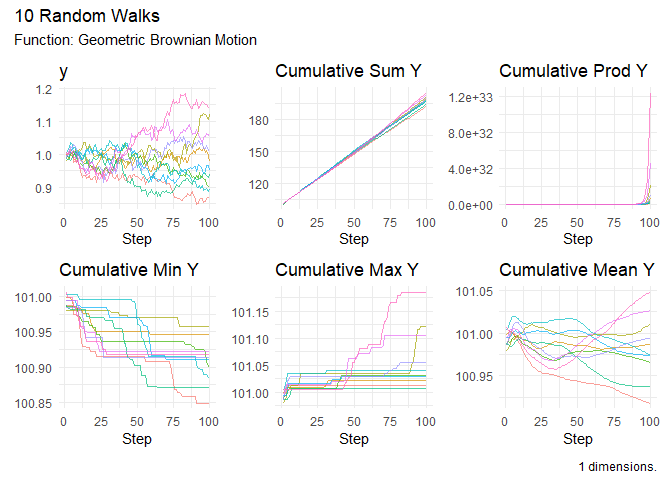
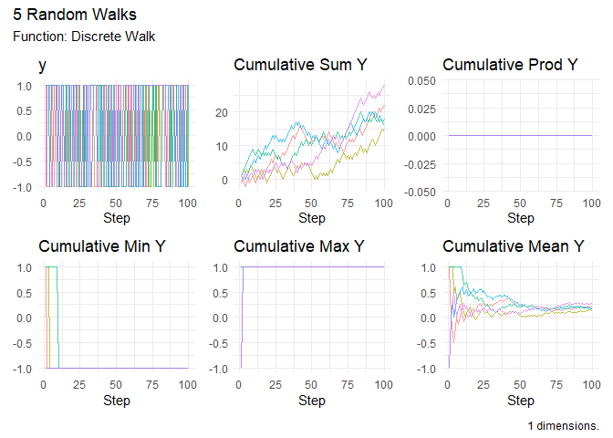

# RandomWalker

> **Generate random walks of various types with tidyverse
> compatibility**

To view the full wiki, click here: [Full RandomWalker
Wiki](https://github.com/spsanderson/RandomWalker/blob/main/wiki/Home.md)

RandomWalker is a comprehensive R package that makes it easy to
generate, visualize, and analyze random walks. Whether you’re modeling
stock prices, simulating particle movements, or exploring stochastic
processes, RandomWalker provides a unified, tidyverse-compatible
interface with extensive distribution support.

## ✨ Key Features

- **🎲 27+ Distribution Types**: Generate random walks from Normal,
  Brownian Motion, Geometric Brownian Motion, Cauchy, Beta, Gamma,
  Poisson, and many more distributions
- **📐 Multi-Dimensional Support**: Create walks in 1D, 2D, or 3D space
- **📊 Rich Visualizations**: Built-in plotting functions with support
  for both static and interactive visualizations
- **📈 Statistical Analysis**: Comprehensive summary statistics
  including cumulative functions, confidence intervals, and distance
  metrics
- **🔧 Tidyverse Compatible**: Works seamlessly with dplyr, tidyr, and
  ggplot2
- **⚡ Easy to Use**: Sensible defaults with extensive customization
  options

## 📦 Installation

Install the stable version from CRAN:

``` r

install.packages("RandomWalker")
```

Or get the development version from GitHub for the latest features and
bug fixes:

``` r

# install.packages("devtools")
devtools::install_github("spsanderson/RandomWalker")
```

## 🚀 Quick Start

### Generate 30 Random Walks

The
[`rw30()`](https://www.spsanderson.com/RandomWalker/reference/rw30.md)
function provides a quick way to generate 30 random walks with 100 steps
each:

``` r

library(RandomWalker)

# Generate random walks
walks <- rw30()
head(walks, 10)
#> # A tibble: 10 × 3
#>    walk_number step_number      y
#>    <fct>             <int>  <dbl>
#>  1 1                     1  0    
#>  2 1                     2  0.952
#>  3 1                     3  0.573
#>  4 1                     4  0.292
#>  5 1                     5  1.06 
#>  6 1                     6  1.39 
#>  7 1                     7  0.727
#>  8 1                     8  0.186
#>  9 1                     9 -0.305
#> 10 1                    10 -0.310
```

### Visualize Random Walks

Create beautiful visualizations with a single function call:

``` r

rw30() |>
  visualize_walks()
```


### Summarize Statistics

Get comprehensive statistical summaries of your random walks:

``` r

# Overall summary
rw30() |>
  summarize_walks(.value = y)
#> # A tibble: 1 × 16
#>   fns   fns_name dimensions mean_val median range quantile_lo quantile_hi
#>   <chr> <chr>         <dbl>    <dbl>  <dbl> <dbl>       <dbl>       <dbl>
#> 1 rw30  Rw30              1  -0.0134  0.302  43.1       -16.9        11.5
#> # ℹ 8 more variables: variance <dbl>, sd <dbl>, min_val <dbl>, max_val <dbl>,
#> #   harmonic_mean <dbl>, geometric_mean <dbl>, skewness <dbl>, kurtosis <dbl>

# Summary by walk
rw30() |>
  summarize_walks(.value = y, .group_var = walk_number) |>
  head(10)
#> # A tibble: 10 × 17
#>    walk_number fns   fns_name dimensions mean_val median range quantile_lo
#>    <fct>       <chr> <chr>         <dbl>    <dbl>  <dbl> <dbl>       <dbl>
#>  1 1           rw30  Rw30              1   0.834   0.911 11.3       -4.14 
#>  2 2           rw30  Rw30              1  -1.63   -1.22   9.43      -5.97 
#>  3 3           rw30  Rw30              1   7.51    7.34  14.3        0.579
#>  4 4           rw30  Rw30              1  10.8    11.7   18.4       -0.147
#>  5 5           rw30  Rw30              1  -3.51   -3.96  12.8       -8.49 
#>  6 6           rw30  Rw30              1   6.98    8.40  21.8       -1.90 
#>  7 7           rw30  Rw30              1   0.392   0.458 11.1       -4.98 
#>  8 8           rw30  Rw30              1  -0.0693 -0.495  9.60      -3.34 
#>  9 9           rw30  Rw30              1   7.54    7.56  11.7        1.55 
#> 10 10          rw30  Rw30              1  -9.22   -8.86  19.6      -18.5  
#> # ℹ 9 more variables: quantile_hi <dbl>, variance <dbl>, sd <dbl>,
#> #   min_val <dbl>, max_val <dbl>, harmonic_mean <dbl>, geometric_mean <dbl>,
#> #   skewness <dbl>, kurtosis <dbl>
```

### Double pendulum trajectories

Simulate continuous-time pendulum motion from randomized starting
angles. The solver (`deSolve`) and animation packages (`gganimate`,
`gifski`) are optional.

``` r

set.seed(287)
pendulum <- double_pendulum_walk(.num_walks = 2, .n = 101)
plot_double_pendulum(pendulum, .walk = 1)
animation <- animate_double_pendulum(pendulum, .walk = 1)
# Render explicitly with gganimate::animate(); construction saves no files.
```

See
[`vignette("double-pendulum", package = "RandomWalker")`](https://www.spsanderson.com/RandomWalker/articles/double-pendulum.md)
for units, deterministic starts, and GIF rendering.

## 🎯 Common Use Cases

### 1. Custom Random Walks with Specific Distributions

``` r

# Normal walk with custom parameters
random_normal_walk(
  .num_walks = 5,
  .n = 50,
  .mu = 0,
  .sd = 0.1,
  .initial_value = 100
) |>
  visualize_walks()
```



``` r


# Geometric Brownian Motion (great for stock prices!)
geometric_brownian_motion(
  .num_walks = 10,
  .n = 100,
  .mu = 0.05,
  .sigma = 0.2,
  .initial_value = 100
) |>
  visualize_walks()
```



### 2. Multi-Dimensional Random Walks

``` r

# 2D random walk
random_normal_walk(.num_walks = 3, .n = 100, .dimensions = 2) |>
  head(10)
#> # A tibble: 10 × 14
#>    walk_number step_number       x       y cum_sum_x cum_prod_x cum_min_x
#>    <fct>             <int>   <dbl>   <dbl>     <dbl>      <dbl>     <dbl>
#>  1 1                     1 -0.0474 -0.117    -0.0474          0   -0.0474
#>  2 1                     2  0.0274 -0.0564   -0.0201          0   -0.0474
#>  3 1                     3  0.142   0.0586    0.122           0   -0.0474
#>  4 1                     4 -0.103   0.276     0.0189          0   -0.103 
#>  5 1                     5  0.0206 -0.134     0.0395          0   -0.103 
#>  6 1                     6 -0.131   0.0759   -0.0919          0   -0.131 
#>  7 1                     7 -0.120   0.0155   -0.211           0   -0.131 
#>  8 1                     8 -0.0595  0.0214   -0.271           0   -0.131 
#>  9 1                     9  0.159   0.0155   -0.112           0   -0.131 
#> 10 1                    10 -0.233   0.178    -0.345           0   -0.233 
#> # ℹ 7 more variables: cum_max_x <dbl>, cum_mean_x <dbl>, cum_sum_y <dbl>,
#> #   cum_prod_y <dbl>, cum_min_y <dbl>, cum_max_y <dbl>, cum_mean_y <dbl>

# 3D random walk
random_normal_walk(.num_walks = 2, .n = 50, .dimensions = 3) |>
  head(10)
#> # A tibble: 10 × 20
#>    walk_number step_number        x        y        z cum_sum_x cum_prod_x
#>    <fct>             <int>    <dbl>    <dbl>    <dbl>     <dbl>      <dbl>
#>  1 1                     1 -0.0119  -0.0963   0.154     -0.0119          0
#>  2 1                     2  0.0345  -0.103   -0.278      0.0225          0
#>  3 1                     3  0.139   -0.0586  -0.0603     0.162           0
#>  4 1                     4 -0.0636  -0.0963   0.00208    0.0983          0
#>  5 1                     5 -0.174   -0.170    0.0608    -0.0755          0
#>  6 1                     6  0.124   -0.0995   0.112      0.0480          0
#>  7 1                     7 -0.111    0.00989 -0.0555    -0.0633          0
#>  8 1                     8 -0.0505  -0.159    0.00208   -0.114           0
#>  9 1                     9  0.0366  -0.0686   0.00471   -0.0772          0
#> 10 1                    10  0.00216 -0.131   -0.0555    -0.0750          0
#> # ℹ 13 more variables: cum_min_x <dbl>, cum_max_x <dbl>, cum_mean_x <dbl>,
#> #   cum_sum_y <dbl>, cum_prod_y <dbl>, cum_min_y <dbl>, cum_max_y <dbl>,
#> #   cum_mean_y <dbl>, cum_sum_z <dbl>, cum_prod_z <dbl>, cum_min_z <dbl>,
#> #   cum_max_z <dbl>, cum_mean_z <dbl>
```

### 3. Discrete Random Walks

``` r

# Discrete walk with upper/lower bounds
discrete_walk(
  .num_walks = 5,
  .n = 100,
  .upper_bound = 1,
  .lower_bound = -1,
  .upper_probability = 0.55,
  .initial_value = 0
) |>
  visualize_walks()
```



## 📚 Available Random Walk Types

RandomWalker supports a wide variety of random walk types:

### Continuous Distributions

- **Normal**:
  [`random_normal_walk()`](https://www.spsanderson.com/RandomWalker/reference/random_normal_walk.md),
  [`random_normal_drift_walk()`](https://www.spsanderson.com/RandomWalker/reference/random_normal_drift_walk.md)
- **Brownian Motion**:
  [`brownian_motion()`](https://www.spsanderson.com/RandomWalker/reference/brownian_motion.md),
  [`geometric_brownian_motion()`](https://www.spsanderson.com/RandomWalker/reference/geometric_brownian_motion.md)
- **Beta**:
  [`random_beta_walk()`](https://www.spsanderson.com/RandomWalker/reference/random_beta_walk.md)
- **Cauchy**:
  [`random_cauchy_walk()`](https://www.spsanderson.com/RandomWalker/reference/random_cauchy_walk.md)
- **Chi-Squared**:
  [`random_chisquared_walk()`](https://www.spsanderson.com/RandomWalker/reference/random_chisquared_walk.md)
- **Exponential**:
  [`random_exponential_walk()`](https://www.spsanderson.com/RandomWalker/reference/random_exponential_walk.md)
- **F-Distribution**:
  [`random_f_walk()`](https://www.spsanderson.com/RandomWalker/reference/random_f_walk.md)
- **Gamma**:
  [`random_gamma_walk()`](https://www.spsanderson.com/RandomWalker/reference/random_gamma_walk.md)
- **Log-Normal**:
  [`random_lognormal_walk()`](https://www.spsanderson.com/RandomWalker/reference/random_lognormal_walk.md)
- **Logistic**:
  [`random_logistic_walk()`](https://www.spsanderson.com/RandomWalker/reference/random_logistic_walk.md)
- **Student’s t**:
  [`random_t_walk()`](https://www.spsanderson.com/RandomWalker/reference/random_t_walk.md)
- **Uniform**:
  [`random_uniform_walk()`](https://www.spsanderson.com/RandomWalker/reference/random_uniform_walk.md)
- **Weibull**:
  [`random_weibull_walk()`](https://www.spsanderson.com/RandomWalker/reference/random_weibull_walk.md)
- **And more!**

### Discrete Distributions

- **Binomial**:
  [`random_binomial_walk()`](https://www.spsanderson.com/RandomWalker/reference/random_binomial_walk.md)
- **Discrete**:
  [`discrete_walk()`](https://www.spsanderson.com/RandomWalker/reference/discrete_walk.md)
- **Geometric**:
  [`random_geometric_walk()`](https://www.spsanderson.com/RandomWalker/reference/random_geometric_walk.md)
- **Hypergeometric**:
  [`random_hypergeometric_walk()`](https://www.spsanderson.com/RandomWalker/reference/random_hypergeometric_walk.md)
- **Multinomial**:
  [`random_multinomial_walk()`](https://www.spsanderson.com/RandomWalker/reference/random_multinomial_walk.md)
- **Negative Binomial**:
  [`random_negbinomial_walk()`](https://www.spsanderson.com/RandomWalker/reference/random_negbinomial_walk.md)
- **Poisson**:
  [`random_poisson_walk()`](https://www.spsanderson.com/RandomWalker/reference/random_poisson_walk.md)

### Custom Walks

- **Custom Displacement**:
  [`custom_walk()`](https://www.spsanderson.com/RandomWalker/reference/custom_walk.md),
  [`random_displacement_walk()`](https://www.spsanderson.com/RandomWalker/reference/random_displacement_walk.md)

## 🛠️ Key Functions

| Function | Description |
|----|----|
| [`rw30()`](https://www.spsanderson.com/RandomWalker/reference/rw30.md) | Quickly generate 30 random walks |
| [`visualize_walks()`](https://www.spsanderson.com/RandomWalker/reference/visualize_walks.md) | Create visualizations (static or interactive) |
| [`summarize_walks()`](https://www.spsanderson.com/RandomWalker/reference/summarize_walks.md) | Generate comprehensive statistics |
| [`subset_walks()`](https://www.spsanderson.com/RandomWalker/reference/subset_walks.md) | Subset walks by max/min values |
| [`euclidean_distance()`](https://www.spsanderson.com/RandomWalker/reference/euclidean_distance.md) | Calculate distances in multi-dimensional walks |
| [`confidence_interval()`](https://www.spsanderson.com/RandomWalker/reference/confidence_interval.md) | Compute confidence intervals |
| [`running_quantile()`](https://www.spsanderson.com/RandomWalker/reference/running_quantile.md) | Calculate running quantiles |

## 📖 Documentation

- **Getting Started Guide**: See
  [`vignette("getting-started")`](https://www.spsanderson.com/RandomWalker/articles/getting-started.md)
- **Function Reference**: [Online
  Documentation](https://www.spsanderson.com/RandomWalker/)
- **Package Website**:
  [RandomWalker](https://www.spsanderson.com/RandomWalker/)
- **News and Updates**: Check
  [NEWS.md](https://www.spsanderson.com/RandomWalker/NEWS.md) for latest
  changes

## 🤝 Contributing

Contributions are welcome! Please feel free to submit a Pull Request.
For major changes, please open an issue first to discuss what you would
like to change.

## 📄 License

This package is licensed under the MIT License. See
[LICENSE.md](https://github.com/spsanderson/RandomWalker/blob/main/LICENSE.md)
for details.

## 👥 Authors

- **Steven P. Sanderson II, MPH** - *Author, Creator, Maintainer* -
  [GitHub](https://github.com/spsanderson)
- **Antti Rask** - *Contributor* - Visualization functions

## 📞 Getting Help

- **Bug Reports**: [GitHub
  Issues](https://github.com/spsanderson/RandomWalker/issues)
- **Questions**: Use GitHub Discussions or Stack Overflow with the
  `randomwalker` tag
- **Website**: <https://www.spsanderson.com/RandomWalker/>

## 🌟 Citation

If you use RandomWalker in your research, please cite:

``` r

citation("RandomWalker")
```

------------------------------------------------------------------------

**Made with ❤️ for the R community**
